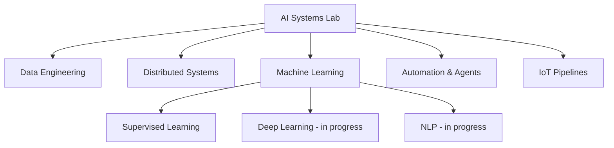

# Davi Marques AI Systems Lab  
### Artificial Intelligence • Data Systems • Distributed Architectures

Research-driven engineering for scalable intelligent systems.

---

## 🧠 About the Lab

The AI Systems Lab is an independent research-oriented initiative focused on:

- Intelligent Data Pipelines
- Distributed Architectures
- Applied Machine Learning
- Automation with AI Agents
- IoT Data Systems

This lab documents the structured evolution from academic foundations to production-level AI engineering.

---

## 🛠 Technical Stack

### Programming

### Data & AI

### Systems & Infrastructure

### Automation & IoT

---

## 📊 Technical Focus Map

---

## 🔬 Research Domains

### 1. Intelligent Data Engineering
- Structured data pipelines
- Fiscal data extraction systems
- Data cleaning & transformation

### 2. Distributed & Parallel Systems
- Academic foundations
- Cloud-based architecture concepts
- Scalable system modeling

### 3. Applied Artificial Intelligence
- Supervised ML (Scikit-learn)
- Generative AI applications
- Model integration in real systems

### 4. Automation & AI Agents
- n8n workflow automation
- AI-enhanced business process design
- Intelligent orchestration

### 5. IoT Data Architectures
- ESP32 sensor systems
- MQTT communication
- IoT → Cloud → BI pipelines

---

## 🏗 Active Project

### FISCALIS  
**Fiscal Data Processing & Intelligent Extraction System**

Modular architecture composed of:

- Ingestion Layer (QR extraction)
- Processing Layer (data retrieval & structuring)
- Visualization Layer (analytics interface)

Designed with architectural clarity and scalability in mind.

---

## 🚀 Projects in Development

Currently expanding the lab with systems focused on:

- Scalable AI pipelines
- Production-oriented ML systems
- IoT monitoring architectures
- Advanced distributed AI frameworks

---

## 🎯 Strategic Direction

2026 objectives:

- Production-ready AI systems
- Deep Learning advancement
- NLP system development
- Scalable distributed architectures
- Open-source AI contribution
- Technical English fluency

---

Engineering Intelligence  
Systemic Thinking  
Long-Term Vision  

